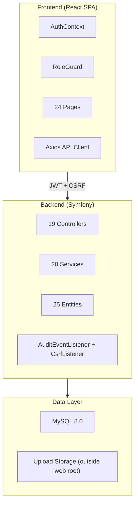
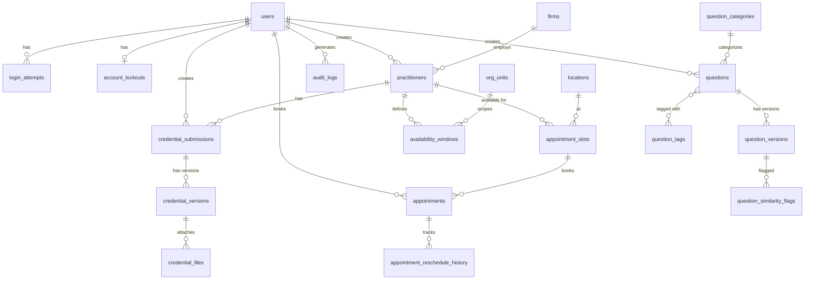
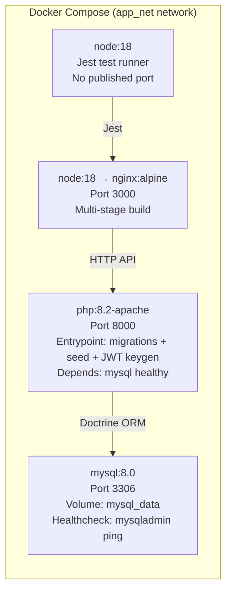

# Architecture & Design Document

## 1. System Overview

The Regulatory Operations & Analytics Portal is a fullstack web application for an on-premise professional services organization that manages credentialed legal practitioners, appointments, controlled content, and auditable analytics. The system operates with **zero internet dependency** at runtime.

### Architecture Pattern

Three-tier architecture with decoupled frontend and backend:

```
┌──────────────────┐     HTTP/JSON      ┌──────────────────┐     Doctrine ORM     ┌──────────────┐
│   React SPA      │ ◄───────────────► │   Symfony API     │ ◄─────────────────► │   MySQL 8.0   │
│   (TypeScript)   │    REST + JWT      │   (PHP 8.2)       │     Prepared Stmts   │               │
│   Port 3000      │                    │   Port 8000        │                      │   Port 3306   │
└──────────────────┘                    └──────────────────┘                      └──────────────┘
```

### Technology Stack

| Layer | Technology | Version |
|-------|-----------|---------|
| Frontend | React + TypeScript + Ant Design | 18.x / 5.x |
| Backend | Symfony (PHP) | 6.4 LTS |
| Database | MySQL | 8.0 |
| Auth | JWT (LexikJWTAuthenticationBundle) | — |
| Containerization | Docker + Docker Compose | — |
| Charts | @ant-design/charts | — |
| Rich Text | react-quill + katex | — |
| PDF Export | dompdf/dompdf | — |
| Spreadsheet | phpoffice/phpspreadsheet | — |

## 2. Module Architecture



### Module Breakdown

| Module | Backend Components | Frontend Pages | Responsibility |
|--------|-------------------|----------------|----------------|
| **Auth & Users** | AuthService, CaptchaService, StepUpAuthService, HumanVerificationInterface | LoginPage, SignupPage, UserManagementPage | Registration, JWT login, lockout (5 attempts/15 min), CAPTCHA, role management, password reset |
| **Practitioner Profiles** | PractitionerService, EncryptionService, FileUploadService | PractitionerListPage, PractitionerDetailPage, FirmManagementPage | CRUD, AES-256 license encryption, masking, file upload (PDF/JPG/PNG ≤10MB), sensitive access logging |
| **Credential Review** | CredentialWorkflowService | CredentialQueuePage, CredentialDetailPage | State machine (DRAFT→SUBMITTED→UNDER_REVIEW→APPROVED/REJECTED/RESUBMISSION_REQUESTED), versioning, rollback with step-up auth |
| **Appointment Scheduling** | BookingService, SlotGenerationService | CalendarWorkbenchPage, AppointmentListPage, AvailabilityConfigPage | Row-level locking (SELECT...FOR UPDATE), 5-min hold, conflict detection, 90-day limit, 2x reschedule, 24h cancellation rule |
| **Question Bank** | QuestionService, QuestionSimilarityService, QuestionImportExportService | QuestionBankPage, QuestionEditorPage | Rich text + formulas, versioning, CSV/XLSX import/export, trigram duplicate detection (80% threshold), rollback |
| **Analytics & Dashboards** | AnalyticsService, ReportExportService | AnalyticsWorkbenchPage, ComplianceDashboardPage | Structured query builder (allowlisted fields), KPI dashboards, trend/distribution/correlation charts, PDF/CSV export |
| **Audit & Governance** | AuditLogService, AlertService | AuditLogPage, SystemAlertsPage | Immutable audit logs (7-year retention), anomaly alerts (rejection threshold, login failures, license reveal volume) |
| **System Admin** | SystemSettingService | SystemSettingsPage, LocationManagementPage, OrgUnitManagementPage | Configurable thresholds, reference data CRUD |

## 3. Domain Model (Entity Relationship)



## 4. Security Architecture

### Authentication
- **JWT-based** via `Authorization: Bearer <token>` header
- Token expiry: 1 hour
- Keys auto-generated at container startup (RSA 4096-bit, AES-256 passphrase from env var)
- bcrypt password hashing (cost factor ≥12)

### Authorization (5 Roles)
```
ROLE_SYSTEM_ADMIN (inherits all)
├── ROLE_CONTENT_ADMIN
├── ROLE_CREDENTIAL_REVIEWER
├── ROLE_ANALYST
└── ROLE_USER
```

Enforced at **both** frontend (RoleGuard route component) and backend (Symfony security voters + controller guards).

### CSRF Protection
- Double-submit cookie pattern
- `XSRF-TOKEN` cookie set on authenticated responses
- `X-XSRF-TOKEN` header required on all state-changing requests (POST/PUT/PATCH/DELETE)
- Excluded: login, register, captcha, Swagger docs

### Field-Level Encryption
- AES-256-CBC for license numbers
- Random IV per encryption
- Key from `LICENSE_ENCRYPTION_KEY` environment variable
- Default display: masked (`***-XXXX`), revealed only via explicit endpoint with access logging

### Upload Security
- 10 MB limit, MIME allowlist (application/pdf, image/jpeg, image/png)
- Server-side MIME validation
- Files stored outside web root, served via controller endpoint

### Login Protection
- 5 failed attempts → 15-minute account lockout + CAPTCHA required
- Locally-generated math CAPTCHA (PHP GD, zero network calls)
- Human verification interface (stub, disabled by default)

## 5. Data Governance

### Immutable Audit Logs
- Every login, CRUD, approval, rejection, rollback, import, export, and license reveal is logged
- Fields: timestamp, user_id, action_type, entity_type, entity_id, old_value_json, new_value_json, ip_address
- `retention_expires_at` set to occurred_at + 7 years
- Cleanup command (`app:audit:cleanup`) is dry-run by default, `--force` to delete expired
- Audit log failures are logged via PSR-3 logger and create CRITICAL alerts (never silently swallowed)

### Anomaly Alerting
- >5 credential rejections for same firm in 24h → HIGH alert
- >10 failed logins for same user in 1h → MEDIUM alert
- >50 license reveals by same user in 1h → HIGH alert
- Deduplicated (no duplicate unacknowledged alerts)

### Versioning & Rollback
- Credential submissions and questions maintain full version history
- Every state transition / edit creates a new version record
- Rollback: ROLE_SYSTEM_ADMIN only + step-up authentication (re-enter password + justification)

## 6. Docker Service Topology



### Startup: `docker compose up --build`
1. MySQL starts with healthcheck
2. Backend waits for healthy MySQL, then: run migrations → generate JWT keys (if absent) → seed data (idempotent) → start Apache
3. Frontend builds React app → serves via nginx

## 7. Testing Strategy

| Suite | Runner | Location | Scope |
|-------|--------|----------|-------|
| Backend Unit | PHPUnit (in backend container) | `backend/tests/Unit/` + `unit_tests/php/` | Encryption, state machine, lockout, booking logic, similarity, validation |
| Backend API | PHPUnit (in backend container) | `backend/tests/Api/` + `API_tests/php/` | All endpoints: happy path + error + auth + concurrency + CSRF |
| Frontend Unit | Jest (in frontend-test container) | `unit_tests/js/` | AuthContext, RoleGuard, component rendering |

Entry point: `./run_tests.sh` (uses `docker compose exec` for all suites)

## 8. Concurrency Safety

Appointment booking uses database-level concurrency control:
1. `SELECT ... FOR UPDATE` row lock on appointment slot
2. Check `available_count > 0` inside transaction
3. Atomically decrement `available_count`
4. Hold expires after configurable timeout (default 5 min)
5. Tested with parallel HTTP requests proving exactly one succeeds
